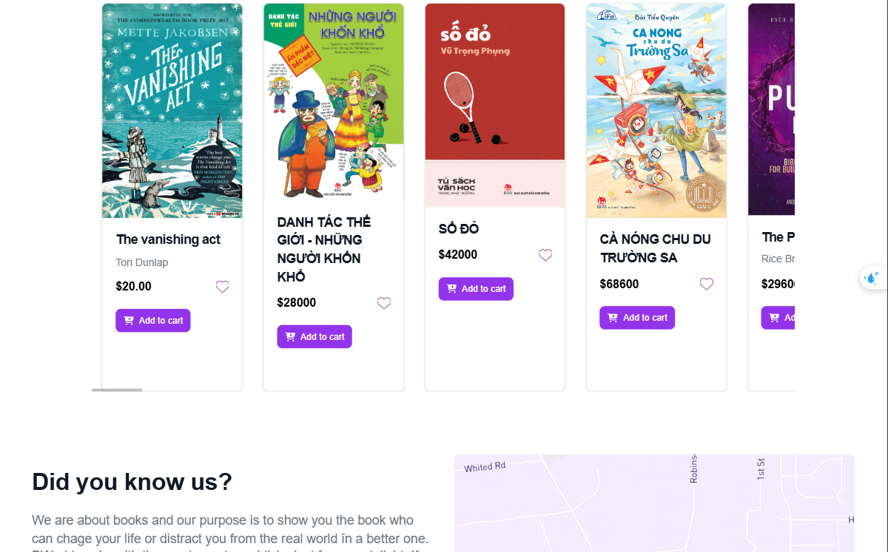
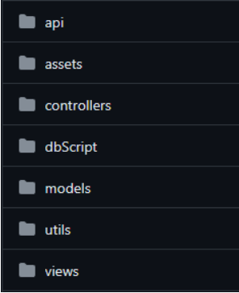
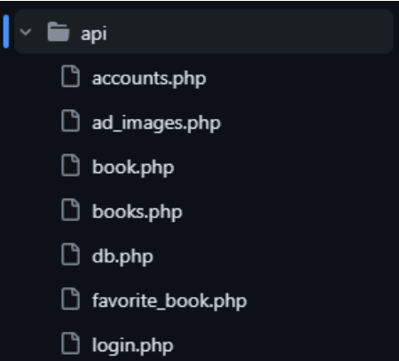

# 
**BookHaven WebSite - Paradise for Book Lovers - BHW**

 Developed by Group 18 - LTW - HK232
 

## Table of content
- [Introduction](#introduction)
- [Technologies Used](#technologies-used)
- [Source code](#source-code)
- [Security & SEO](#security--seo)
- [Software Design - Thiết kế phần mềm](#software-design---thiết-kế-phần-mềm)
- [Source Code Structure](#source-code-structure)
- [Software Features - Các tính năng của phần mềm](#software-features---các-tính-năng-của-phần-mềm)
- [Implementation](#implementation)
- [Feature Overview](#feature-overview)
- [Installation Guide](#installation-guide)
- [Contributors](#contributors)

## **📌Introduction**
🎓 BookHaven is an e-commerce platform dedicated to books, providing a modern and convenient shopping experience for book lovers. With the rapid growth of the Internet and changing consumer behavior, BookHaven was created to meet the demand for easy, fast, and seamless book discovery and purchasing.

🎓 Inspired by Fahasa, BookHaven offers a familiar and intuitive interface, allowing users to browse, search, and purchase books with ease. Customers can also create personal accounts to save their favorite books, track orders, and receive exclusive deals.

🎓 Beyond being a shopping platform, BookHaven helps businesses promote their products, connect with partners, and provide information about bookstores, promotions, and customer support services. With a modern, intuitive design and optimized features, BookHaven promises to be "The Paradise for Book Lovers" – delivering the best reading and shopping experience for book enthusiasts of all ages.

## 🛠**Technologies Used**

BookHaven is built using a modern and efficient technology stack, ensuring a seamless user experience, maintainability, and scalability. Below are the core technologies and tools powering the platform:

- Frontend & UI:
  - `Tailwind CSS` – A utility-first CSS framework that enables rapid UI development with reusable classes, providing flexibility without writing extensive custom CSS.

- Backend Development:
  - `PHP (Core PHP)` – A widely-used scripting language that allows complete control over the application without relying on additional frameworks. This ensures a lightweight, customizable, and performance-driven backend.

  - `MySQL with MySQLi` – A robust relational database system that integrates efficiently with PHP, offering secure and optimized data management through prepared statements.

- API & Testing:
  - `Postman` – A powerful API testing and debugging tool, streamlining API development and ensuring reliability through structured request-response testing.

- Version Control & Collaboration:
  - `GitHub` – A cloud-based version control system facilitating seamless code management, collaboration, and deployment with features like branching, pull requests, and issue tracking.

- JavaScript Enhancements:
  - `jQuery` – A lightweight JavaScript library that simplifies DOM manipulation, AJAX requests, and event handling, enhancing user interactivity and responsiveness.

🏆 **Strengths & Trade-offs**
| Technology | Strengths | Trade-offs |
|-------|-------|-------|
| Tailwind CSS | Rapid development, highly customizable UI, no need for additional CSS files | Can lead to cluttered HTML with excessive utility classes |
| PHP | Full control over code, widely supported, strong community | Can become unstructured if not well-organized |
| MySQLi | Secure data handling, prepared statements prevent SQL injection | More code required for complex operations compared to ORM |
| Postman | Efficient API testing, intuitive UI	 | Limited for deep application-level integration testing |
| GitHub | Strong collaboration tools, version control, team coordination | Steeper learning curve for Git workflows |
| jQuery | Simplifies DOM interactions and AJAX requests | Can lead to performance overhead if used excessively |

By leveraging these technologies, BookHaven offers a robust, user-friendly, and scalable platform that ensures a smooth book shopping experience while maintaining security, efficiency, and ease of development.

## 🚀**Source code:**

The source code of the software can be accessed via the following link:

🔗 [BookHaven WebSite SourceCode](https://github.com/DanteBartel/HK232_Web_Nh-m_18_BTL)

## 📌**Security & SEO** 
🚀 **Security**:

Security is a crucial factor in website development, ensuring user data protection and maintaining trust. An unsecured website may be vulnerable to attacks, data leaks, and a poor user experience.

To enhance security, **BookHaven** implements basic measures such as:
- **Using HTTPS** to ensure a secure connection.
- **Protecting user data**, especially login credentials.
- **Regularly checking and fixing security vulnerabilities** to minimize potential risks.

While it's impossible to eliminate all threats, these measures help make the website safer and better protect users.

🚀 **SEO**:

Search Engine Optimization (SEO) helps a website appear on search engines like Google, increasing its reach to potential customers.

Some ways BookHaven improves SEO:
- **Optimizing content** with clear titles and descriptions.
- **Enhancing page loading speed** for a better user experience.
- **Ensuring mobile-friendly design**, making it accessible across multiple devices.

With these simple adjustments, **BookHaven** can reach a wider audience and make it easier for customers to find products on the website.

## 📌**Software Design - Thiết kế phần mềm** 
### Database: 

🚀 The database implementation includes the following data types:

- `Varchar`: Used instead of `char` because `varchar` has a variable length depending on usage, while `char` has a fixed length. This helps save storage when dealing with attributes of uncertain length. Additionally, using `varchar` instead of `int` for some fields ensures that leading zeros in input values are preserved.

- `Int`: Used for certain ID fields to reduce storage requirements. However, when using `int` for ID or code fields, leading zeros will be automatically removed.

- `Double`: Chosen for attributes like price, which may have large values. `Double` can store up to 8 bytes, significantly more than the 4 bytes of `float`, ensuring greater precision in calculations.

- `Tinyint`: Used exclusively for the `type` attribute. This is suitable for boolean-like values and helps optimize storage. In MySQL, `BOOLEAN` is essentially `TINYINT(1)`. In the `type` field, `0` represents an admin account, while `1` represents a user account.

🚀 The database consists of four tables:

- `Account`: Stores user account information, including `username`, `password`, `type` (0 for admin, 1 for user), and `email`.

- Book: Stores book details. Three fields—`isbn`, `author`, and `image`—are nullable. The `username` field must be unique.

- `Favorite book`: Stores the "favorite" relationship between users and books, containing two foreign keys referencing the `Account` and `Book` tables.

- `Ad_images`: Stores additional images for a book.

🚀 Relationships:

- `Account` has a one-to-many relationship with `Favorite book`, with cascade delete enabled.

- `Book` has a one-to-many relationship with `Favorite book`, also with cascade delete enabled.

- `Book` has a one-to-many relationship with `Ad_images`, where deleting a book cascades to its associated images.

### Application Model:

Our team chose the `MVC (Model-View-Controller)` pattern for this project. MVC is a software design pattern that separates an application into three interconnected components, improving organization, maintainability, scalability, and code reusability.

- `Model`: Handles data and business logic. It represents application data and the operations that can be performed on it. Separating the model from other components allows us to modify or expand data processing logic without affecting the user interface.

- `View`: The user interface that displays data from the model and provides an interactive experience. The separation between the view and other components enables UI modifications without impacting data processing.

- `Controller`: Manages application flow and user input. It receives user requests, interacts with the model to fetch data, and updates the view accordingly. This separation ensures a clear control flow and simplifies testing.

## 📌**Source Code Structure** 

The source code is stored and accessed by team members through the GitHub platform. The source code structure is organized as follows:

It is divided into three main parts:

- MVC Application Model
- Data
- API and Utils

The directories containing the MVC model manage the application's codebase structure and are organized into three folders:

- `/models`: Handles data and business logic
- `/views`: Manages the user interface display
- `/controllers`: Controls and directs the website's workflow

The **data-related directories** include the database and resources used during website development, divided into:

- `/dbScript`: Database scripts
- `/assets`: Website resources

The API and Utils directories contain API calls for website communication and supporting logic, divided into:
- `/api`: API management
- `/utils`: Supporting logic

## 📌**Software Features - Các tính năng của phần mềm**

The website features are categorized based on user access levels, with the hierarchy: Guest -> User -> Admin. This classification helps the team identify the necessary functionalities for each user group, ensuring the implementation meets the specific needs of different access levels.

**1. Guest Access:**

The `Guest` level is the lowest access tier, applicable to first-time visitors or users who do not wish to create an account. Regardless of the access level, all users can view the `Home page`, which provides an overview of the website.

Additionally, users at this level can register and log in to store their favorite books.

**Features available for Guests**:

- View the Home page, recommended books, and promotions
- Browse the complete book collection on the website
- Register and log in

**2. User Access:**

At the `User` level, users have created an account and logged in to access their `personalized experience`. This level allows users to `manage their personal book collection`, saving books of interest. They can also update their account information.

**Features available for Users:**

- View the Home page, recommended books, and promotions
- Browse the complete book collection
- Log out of their account
- Edit account information
- Manage their favorite book collection

**3. Admin Access:**

This is the `highest access level`, designated for `business administrators` to manage the website efficiently. Admins can `add, delete, and modify information` about all books displayed on the site. Similarly, they have the ability to `delete user accounts` if necessary.

**Features available for Admins:**

- View, add, edit, and delete books
- View and delete user accounts
- View, add, edit, and delete additional book images

## 📌**Implementation**

### **Feature Overview**

## 📌**Installation Guide**

## 🏆Contributors